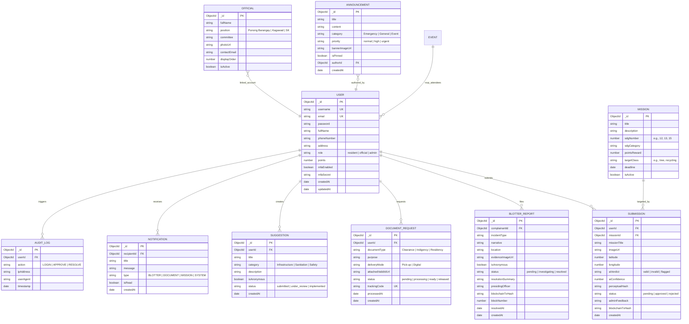

# 🗄️ Mission 17 & Barangay E-Services: Database Schema & Entity-Relationship Model

**Database Engine:** MongoDB Atlas (v7.0+) • **Object Data Modeling (ODM):** Mongoose (v8.0+) • **Storage Security:** AES-256

---

## 📊 1. Entity-Relationship Diagram (ERD)

---

## 📑 2. Comprehensive Data Dictionary

### 2.1 `User` Collection (`users`)
| Field Name | Type | Index | Required | Default | Description / Constraints |
| :--- | :--- | :---: | :---: | :---: | :--- |
| `_id` | `ObjectId` | Primary Key | Yes | Auto | Unique MongoDB Identifier |
| `username` | `String` | Unique (`IXSCAN`) | Yes | None | Unique citizen handle (3–30 chars) |
| `email` | `String` | Unique (`IXSCAN`) | Yes | None | RFC 5322 validated email |
| `password` | `String` | No | Yes | None | Bcrypt hash (`saltRounds = 10`) |
| `fullName` | `String` | No | Yes | None | Official citizen name |
| `role` | `String` | Single (`IXSCAN`) | Yes | `'resident'` | Enum: `['resident', 'official', 'admin']` |
| `points` | `Number` | Single (`IXSCAN`) | No | `0` | Cumulative SDG reward point balance |
| `mfaEnabled` | `Boolean` | No | No | `true` | Enforces 6-digit email OTP |
| `createdAt` | `Date` | No | Yes | `Date.now` | ISO 8601 registration timestamp |

---

### 2.2 `Submission` Collection (`submissions`)
| Field Name | Type | Index | Required | Default | Description / Constraints |
| :--- | :--- | :---: | :---: | :---: | :--- |
| `_id` | `ObjectId` | Primary Key | Yes | Auto | Unique Submission ID |
| `userId` | `ObjectId` | Compound Index | Yes | None | References `User._id` |
| `missionId` | `ObjectId` | Single (`IXSCAN`) | Yes | None | References `Mission._id` |
| `imageUrl` | `String` | No | Yes | None | Cloudinary CDN media link |
| `aiVerdict` | `String` | Single (`IXSCAN`) | No | `'pending'` | Enum: `['valid', 'invalid', 'flagged']` |
| `aiConfidence` | `Number` | No | No | `0.0` | Probability float ($0.0 \le x \le 1.0$) |
| `perceptualHash`| `String` | Single (`IXSCAN`) | No | None | 64-bit hexadecimal pHash |
| `status` | `String` | Compound Index | Yes | `'pending'` | Enum: `['pending', 'approved', 'rejected']` |
| `blockchainTxHash`| `String`| No | No | `null` | Sepolia transaction receipt |

**Compound Indices:**
* `{ userId: 1, status: 1, createdAt: -1 }` (Accelerates user history queries)
* `{ status: 1, createdAt: -1 }` (Accelerates admin moderation queue)

---

### 2.3 `BlotterReport` Collection (`blotters`)
| Field Name | Type | Index | Required | Default | Description / Constraints |
| :--- | :--- | :---: | :---: | :---: | :--- |
| `_id` | `ObjectId` | Primary Key | Yes | Auto | Unique Blotter Record ID |
| `complainantId`| `ObjectId` | Single (`IXSCAN`) | Yes | None | References `User._id` |
| `incidentType` | `String` | No | Yes | None | Category of incident |
| `narrative` | `String` | Text Search | Yes | None | Detailed testimony statement |
| `status` | `String` | Compound Index | Yes | `'pending'` | Enum: `['pending', 'investigating', 'resolved']` |
| `blockchainTxHash`| `String`| Single (`IXSCAN`) | No | `null` | Cryptographic Sepolia anchor |
| `blockNumber` | `Number` | No | No | `null` | Block height where minted |

---

### 2.4 `AuditLog` Collection (`auditlogs`)
| Field Name | Type | Index | Required | Default | Description / Constraints |
| :--- | :--- | :---: | :---: | :---: | :--- |
| `_id` | `ObjectId` | Primary Key | Yes | Auto | Unique Log ID |
| `userId` | `ObjectId` | Single (`IXSCAN`) | Yes | None | References `User._id` |
| `action` | `String` | Compound Index | Yes | None | System action code |
| `ipAddress` | `String` | No | Yes | None | IPv4 / IPv6 client address |
| `userAgent` | `String` | No | Yes | None | Client browser/device string |
| `timestamp` | `Date` | Compound Index | Yes | `Date.now` | Non-repudiable timestamp |

**Compound Index:**
* `{ timestamp: -1, action: 1 }` (Optimizes chronological security audits)
