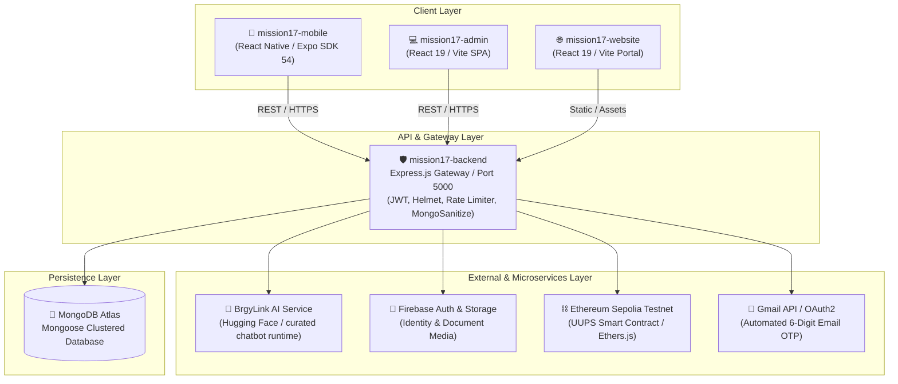

# 💻 BrgyLink: Developer Manual & Engineering Onboarding Guide
### *Technical Architecture, Setup, Development Standards, and Workflows*

---

> [!NOTE]
> **Document Version:** `2.2.0`
> **Target Audience:** Full-stack developers, mobile engineers, AI/ML engineers, and technical contributors.
> **Related Documentation:** [API Docs](./API_DOCS.md) • [Database Schema](./DATABASE_SCHEMA.md) • [Deployment Guide](./DEPLOYMENT.md) • [Testing Suite](./TESTING.md) • [Smart Contracts](./SMART_CONTRACT.md) • [Security & Threat Model](./SECURITY.md)

---

## 📑 Table of Contents
1. [System Overview & Architecture](#1-system-overview--architecture)
2. [Subsystem Breakdown & Tech Stack](#2-subsystem-breakdown--tech-stack)
3. [Local Development Setup](#3-local-development-setup)
4. [Standing Engineering Rules & Coding Standards](#4-standing-engineering-rules--coding-standards)
5. [Key Developer Workflows](#5-key-developer-workflows)
   - [5.1 IP Syncing for Mobile & Local Backend](#51-ip-syncing-for-mobile--local-backend)
   - [5.2 Mobile Updates via Expo OTA](#52-mobile-updates-via-expo-ota)
   - [5.3 Running Automated Tests](#53-running-automated-tests)
6. [Core Service Logic & Data Flows](#6-core-service-logic--data-flows)
   - [6.1 Resident Registration & OTP Verification](#61-resident-registration--otp-verification)
   - [6.2 Document Request Fulfillment Lifecycle](#62-document-request-fulfillment-lifecycle)
   - [6.3 Blotter & Lupon Hearing Mediation](#63-blotter--lupon-hearing-mediation)
   - [6.4 BrgyLink AI Chatbot](#64-brgylink-ai-chatbot)
   - [6.5 Blockchain Record Verification](#65-blockchain-record-verification)
7. [Environment Variables Reference](#7-environment-variables-reference)
8. [Documentation Index](#8-documentation-index)

---

## 🏛️ 1. System Overview & Architecture

BrgyLink is an e-governance system for Barangay Bagong Pag-asa. It connects the resident mobile app, the officials dashboard, and the public website to a centralized Express API backed by MongoDB Atlas, Firebase Authentication, a Hugging Face-hosted BrgyLink AI chatbot service, and an Ethereum Sepolia audit reference.



---

## 📦 2. Subsystem Breakdown & Tech Stack

| Directory | Role | Primary Technologies | Key Entry Points |
| :--- | :--- | :--- | :--- |
| [`mission17-backend`](./mission17-backend) | Core REST API Gateway & Business Logic | Node.js v20+, Express.js, Mongoose, Ethers.js, JWT, Gmail API | `index.js`, `routes/`, `models/` |
| [`mission17-mobile`](./mission17-mobile) | Resident Mobile Application | React Native, Expo SDK 54, React Navigation | `App.tsx`, `src/screens/`, `src/components/` |
| [`mission17-admin`](./mission17-admin) | Barangay Officials Dashboard | React 19, Vite, TailwindCSS / Vanilla CSS, Firebase | `src/main.jsx`, `src/App.jsx` |
| [`mission17-website`](./mission17-website) | Public Information Portal & Manual Hub | React 19, Vite, Lucide Icons | `src/App.jsx`, `public/` |
| [`mission17-ai`](./mission17-ai) | Curated BrgyLink chatbot runtime and AI-service source | Python, Flask, curated intents and knowledge base | `chatbot_runtime/`, `app.py` |

---

## 🛠️ 3. Local Development Setup

### Prerequisites
* **Node.js**: `v20.0.0` or higher (`node -v`)
* **npm**: `v9.0.0` or higher (`npm -v`)
* **Python**: `3.10+` (for AI tests and ML scripts)
* **Expo CLI**: `npm install -g expo-cli eas-cli`
* **Git**

### Step-by-Step Initialization

#### 1. Backend Setup
```bash
cd mission17-backend
npm install
# Ensure .env is populated with MongoDB Atlas URI and JWT Secrets
npm run dev
# Server boots at http://localhost:5000 (Health check: http://localhost:5000/api/health)
```

#### 2. Mobile App Setup (Expo)
```bash
cd mission17-mobile
npm install

# Run IP sync if testing on physical device via LAN:
node ../sync-ip.js

# Launch Expo bundler:
npx expo start
```

#### 3. Admin Dashboard Setup
```bash
cd mission17-admin
npm install
npm run dev
# Boots at http://localhost:5173
```

#### 4. Public Website Setup
```bash
cd mission17-website
npm install
npm run dev
# Boots at http://localhost:5174
```

---

## ⚖️ 4. Standing Engineering Rules & Coding Standards

All developers contributing to `mission17` must strictly enforce these repository rules:

1. **Mobile Updates (Over-The-Air First):**
   * Use an Over-The-Air (OTA) update only when the installed app has a compatible runtime version. Build a new APK when native dependencies, permissions, Android configuration, or runtime version change.
2. **Error Handling:**
   * Always wrap `async/await` calls in robust `try/catch` blocks.
   * Log descriptive context (e.g., `console.error('Failed to update blotter case status:', error)`).
3. **Environment Variables & Secrets:**
   * **Never hardcode secrets** (private keys, API tokens, MongoDB connection strings) in source code.
   * Read strictly from `process.env` via `dotenv`.
4. **Clean Code & Hygiene:**
   * No unused imports or variables.
   * Strip all temporary debugging `console.log` statements before opening pull requests.
5. **UI / UX Responsiveness:**
   * Use React Native Flexbox layouts instead of hardcoded pixel dimensions to guarantee cross-device compatibility.
   * Provide visual loading indicators (spinners) and network error fallbacks to avoid application crashes.

---

## 🚀 5. Key Developer Workflows

### 5.1 IP Syncing for Mobile & Local Backend
When testing the mobile app on a physical Android/iOS phone on your local Wi-Fi network, the mobile app needs your computer's current LAN IP address. Use the included helper script:

```bash
# In the repository root:
node sync-ip.js
```
*This automatically detects your active local IPv4 address and updates `mission17-mobile/src/config/api.ts`.*

### 5.2 Mobile Updates via Expo OTA
To publish instant updates to resident devices without requiring an APK re-install:

```bash
cd mission17-mobile

# Publish OTA update to production branch:
eas update --channel production --platform android --message "Describe the resident-facing change"
```

### 5.3 Running Automated Tests
Run the checks that cover the code you changed before committing or publishing:

```bash
# Backend
cd mission17-backend
npm test -- --runInBand
npm run lint

# Mobile
cd ../mission17-mobile
./node_modules/.bin/tsc --noEmit

# Admin dashboard
cd ../mission17-admin
npm run build
```

---

## 🔄 6. Core Service Logic & Data Flows

### 6.1 Resident Registration & OTP Verification
```
[Resident enters email] ──> POST /api/auth/start-signup-verification
                              ├── Validates the email address
                              ├── Generates and emails a 6-digit verification code
                              └── Returns the resend timer

[Resident enters OTP] ─────> POST /api/auth/verify-signup-email
                              └── Returns a short-lived signup verification token

[Resident completes form] ─> POST /api/auth/register-resident
                              ├── Creates Firebase and application records
                              ├── Stores valid-ID images through the configured media service
                              └── Sets the account to pending barangay approval
```

### 6.2 Document Request Fulfillment Lifecycle
```
[Resident Mobile]   ──> POST /api/document-requests (Pending)
                                  │
[Authorized staff]  ──> GET /api/document-requests
                        PATCH /api/document-requests/:id/status
                                  │
[Push Notification] ──> Resident receives notification: "Document Ready for Pickup!"
                                  │
[Express Window]    ──> Resident presents the request at the barangay office ➔ Staff marks status: 'Completed'
```

### 6.3 Blotter & Lupon Hearing Mediation
* **Filing:** Resident submits incident category, precise location, narrative, and evidence (`POST /api/blotter-reports`).
* **Mediation:** Admin reviews complainant statement and schedules Lupon Hearing (`stage: 1st/2nd/3rd Hearing`, date, presiding officer).
* **Summons Draft:** Automatically compiles generic Lupon Summons once hearing details are populated.
* **Resolution:** A resolved report may create a blockchain audit transaction and save its transaction hash as a tamper-evident reference. This legacy contract transaction is not a resident reward and must not be presented as one.

### 6.4 BrgyLink AI Chatbot
* **Endpoint:** `POST /api/chatbot`.
* **Purpose:** Provides curated guidance for BrgyLink services, documents, blotters, account recovery, announcements, and the current officials roster when available.
* **Safety:** The chatbot must not expose OTP codes, passwords, reset links, internal records, or unverified changing information. When the remote service is unavailable, the backend returns a safe local fallback.
* **Mobile experience:** Suggested FAQ prompts are shown before a resident starts a conversation; typed follow-up questions remain available.

### 6.5 Blockchain Record Verification
* **Trigger:** An authorized official resolves a blotter report.
* **Stored evidence:** The report stores `blockchainTxHash` after the transaction confirms.
* **Current contract boundary:** The deployed contract still uses a legacy `awardPoints` method with the official wallet. The application wrapper is named `createResolvedBlotterAuditTransaction` to describe its actual BrgyLink purpose.
* **Future improvement:** Replace the legacy points call with a contract method that records a salted or otherwise privacy-preserving blotter-reference hash.

---

## 🔑 7. Environment Variables Reference

### Backend (`mission17-backend/.env`)
```env
PORT=5000
MONGO_URI=mongodb+srv://<user>:<password>@cluster.mongodb.net/brgylink
JWT_SECRET=your_jwt_private_secret_key
CHATBOT_AI_URL=https://<your-huggingface-space>.hf.space
AI_SERVICE_TOKEN=your_ai_service_token
# Preferred chatbot endpoint. AI_SERVER_URL remains a backward-compatible fallback.
AI_SERVER_URL=https://<your-ai-service>.hf.space/predict
SEPOLIA_RPC_URL=https://eth-sepolia.g.alchemy.com/v2/...
ADMIN_PRIVATE_KEY=0x...
CONTRACT_ADDRESS=0x...
VERIFY_CONTRACT_ADDRESS=0x...
FIREBASE_WEB_API_KEY=your_firebase_web_api_key
GOOGLE_CLIENT_ID=your_gmail_oauth_client_id
GOOGLE_CLIENT_SECRET=your_gmail_oauth_client_secret
GOOGLE_REFRESH_TOKEN=your_gmail_refresh_token
EMAIL_USER=official@example.com
```

---

## 📚 8. Documentation Index

For deep-dive topics, consult the dedicated repository manuals:

| Topic | Document Link | Description |
| :--- | :--- | :--- |
| **REST API Reference** | [`API_DOCS.md`](./API_DOCS.md) | Full endpoint contracts, payloads, and response codes. |
| **Database Schemas** | [`DATABASE_SCHEMA.md`](./DATABASE_SCHEMA.md) | Mongoose models, data dictionaries, indexes. |
| **Production Deployment** | [`DEPLOYMENT.md`](./DEPLOYMENT.md) | PM2, Lightsail, Vercel, EAS deployment instructions. |
| **Testing Guide** | [`TESTING.md`](./TESTING.md) | Automated test suites and manual validation checklist. |
| **Smart Contract** | [`SMART_CONTRACT.md`](./SMART_CONTRACT.md) | Solidity code, Sepolia ABI, and audit-record context. |
| **Security & Threat Model** | [`SECURITY.md`](./SECURITY.md) / [`THREAT_MODEL.md`](./THREAT_MODEL.md) | RBAC, encryption, sanitization, and threat mitigations. |
| **Operations & Policies** | [`MAINTENANCE.md`](./MAINTENANCE.md) | Backup policies and server maintenance runbooks. |
| **End-User / Citizen Guide** | [`INFOGRAPHIC_USER_MANUAL.md`](./INFOGRAPHIC_USER_MANUAL.md) | Resident and administrative user workflows. |
| **Coding Standards** | [`.agents/AGENTS.md`](./.agents/AGENTS.md) | Core repository rules, OTA guidance, and style guide. |

---

<div align="center">

**Barangay Bagong Pag-asa E-Services (BrgyLink)**
*Maintained by the Mission17 Engineering Team • 2026*

</div>
