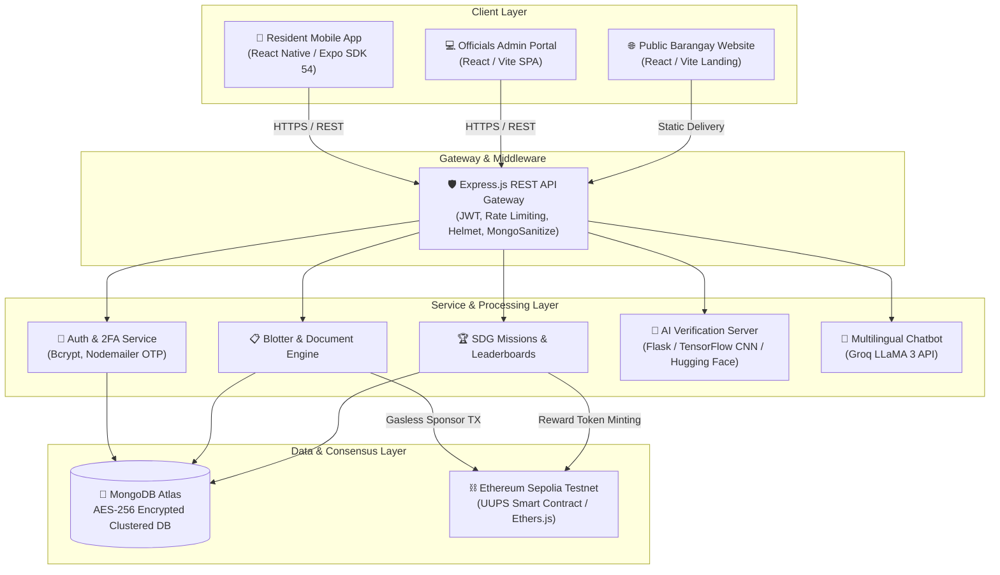

# 🏛️ Barangay Bagong Pag-asa E-Services & Mission 17 Portal

<div align="center">


**A Hybrid Smart Governance & Gamified Civic Sustainability Platform for Philippine Local Government Units (LGUs)**

[Explore API Docs](./API_DOCS.md) • [Capstone Thesis Guide](./CAPSTONE_GUIDE.md) • [Defense Rubric Guide](./DEFENSE_RUBRIC_GUIDE.md) • [Security & Threat Model](./SECURITY.md)

</div>

---

## 📌 Executive Summary

**Barangay Bagong Pag-asa E-Services & Mission 17** is an integrated e-Governance and civic gamification ecosystem designed to bridge the digital divide in local government units. By combining modern mobile e-services (inspired by the Philippine *eGovPH* initiative) with **Mission 17**—a gamified system aligned with the United Nations Sustainable Development Goals (UN SDGs)—the platform transforms civic participation from a passive obligation into an active, rewarding experience.

The platform integrates:
1. **AI-Powered Image Verification & Anti-Cheat Pipeline**: Computer Vision (CNN) and perceptual hashing to validate photographic proof of civic activities (e.g., Tree Planting, Waste Segregation).
2. **Blockchain-Backed Immutability**: Ethereum Sepolia smart contracts that record blotter report resolutions and civic rewards with tamper-evident mathematical finality via gasless sponsor transactions.
3. **Multilingual AI Assistant**: Groq-powered LLaMA 3 chatbot offering 24/7 civic guidance in **English, Tagalog, Pangasinan, and Ilocano**.
4. **Multi-Platform Architecture**: Resident Mobile App (Expo/React Native), Official Admin Dashboard (React/Vite), and Public Barangay Web Portal (React/Vite).

---

## 🏛️ System Architecture



---

## ✨ Key Features & Capabilities

### 1. 🏛️ E-Governance Core (Barangay E-Services)
* **📝 Tamper-Proof Blotter Resolution**: Residents submit incident reports with location tagging and evidence. Upon resolution by officials, an immutable SHA-256 event hash is minted to the Ethereum Sepolia blockchain.
* **📄 Digital Document Requests**: Streamlined issuance for Barangay Clearances, Certificates of Indigency, and Residency IDs with real-time status tracking.
* **💡 Transparent Community Suggestions**: Public or anonymous suggestion box for civic infrastructure and safety improvements.
* **📢 Community Bulletin & Alerts**: Broadcast announcements, emergency advisories, and localized push notifications.
* **👥 Barangay Officials Directory**: Public hierarchy and contact matrix of Punong Barangay, Sangguniang Barangay Kagawads, and SK Officials.

### 2. 🌍 Mission 17: SDG Civic Gamification
* **📸 Automated AI Proof Verification**: Custom Convolutional Neural Network (CNN) hosted on Hugging Face Spaces analyzes uploaded photo evidence for missions such as Tree Planting (SDG 13/15) and Waste Recycling (SDG 12).
* **🛡️ Perceptual Anti-Cheat Hashing**: Prevents image spoofing, recycled photos, and point farming by cross-referencing visual fingerprints against historic submissions.
* **🏆 Community Leaderboard & Badges**: Real-time points tally, tier progression, and verified token rewards.

### 3. 🤖 Multilingual Smart Chatbot
* **Real-Time Civic Navigation**: Instant answers to common barangay inquiries, ordinance questions, and clearance guidelines.
* **4 Supported Languages**: English, Tagalog, Pangasinan, and Ilocano powered by Groq LLaMA 3.

---

## 🛠️ Complete Technology Stack

| Layer | Technology | Purpose / Rationale |
| :--- | :--- | :--- |
| **Mobile Frontend** | React Native (Expo SDK 54), TypeScript | Cross-platform (Android/iOS) responsive mobile client |
| **Admin Frontend** | React 18, Vite, Vanilla CSS Design System | High-performance dashboard for barangay staff |
| **Public Portal** | React 18, Vite, Lucide Icons | Responsive public landing and information portal |
| **Backend Runtime** | Node.js (v18+), Express.js | Modular MVC REST API with centralized error handling |
| **Database** | MongoDB Atlas, Mongoose ODM | Clustered NoSQL document store with compound indexing |
| **Computer Vision** | Python 3.10, Flask, TensorFlow, Docker | Dedicated AI service hosted on Hugging Face Spaces |
| **LLM Engine** | Groq Cloud API, LLaMA 3 70B/8B | Low-latency inference for multilingual chatbot queries |
| **Blockchain** | Solidity (v0.8+), UUPS Proxy, Ethers.js | Immutable audit trail on Ethereum Sepolia Testnet |
| **Authentication** | JWT, Bcrypt (Salt Factor 10), Nodemailer MFA | Multi-factor authentication with 6-digit email OTP |
| **Security Suite** | Helmet, Mongo-Sanitize, XSS-Clean, Express-Rate-Limit | Hardened API gateway adhering to OWASP Top 10 |

---

## 📂 Repository Structure

```bash
mission17/
├── mission17-mobile/          # React Native (Expo) Resident Mobile App
│   ├── src/screens/          # Mobile UI screens (Auth, Blotter, Missions, Profile, etc.)
│   ├── src/components/       # Reusable components & eGovPH design system
│   ├── src/services/         # API integration, Firebase messaging & storage
│   └── app.json              # Expo configuration & EAS OTA update channels
│
├── mission17-admin/           # Vite + React Admin Dashboard
│   ├── src/pages/            # Blotter management, Approvals, Analytics, Officials
│   └── src/components/       # Admin sidebar, tables, modals, verification queues
│
├── mission17-website/         # Vite + React Public Barangay Portal
│   ├── public/               # Public assets & downloadable BrgyLink.apk
│   └── src/App.jsx           # Landing page with services, bulletins & officials
│
├── mission17-backend/         # Express.js REST API Server
│   ├── routes/               # 13 Modular REST API route handlers
│   ├── controllers/          # Business logic and request orchestrators
│   ├── models/               # Mongoose Schemas (User, Submission, Blotter, AuditLog)
│   ├── contracts/            # Solidity smart contracts & UUPS upgradeable proxies
│   └── config/               # Database, nodemailer, and security configurations
│
├── mission17-ai/              # Python Flask Computer Vision Server
│   ├── app.py                # Flask REST endpoints for /predict and anti-cheat
│   ├── evaluate_model.py     # Evaluation scripts, confusion matrix, F1-score
│   └── Dockerfile            # Container deployment for Hugging Face Spaces
│
├── API_DOCS.md               # Complete REST API specification
├── CAPSTONE_GUIDE.md         # Academic manuscript mapping (Chapters 1–5)
├── DEFENSE_RUBRIC_GUIDE.md   # Oral defense scripting & panel rubric proof
├── SECURITY.md               # Security posture, encryption & RBAC documentation
├── THREAT_MODEL.md           # STRIDE & DREAD threat analysis matrix
├── DEPLOYMENT.md             # Production hosting & CI/CD deployment guide
├── OPTIMIZATION_REPORT.md    # Database, gas, and latency optimization benchmarks
├── MAINTENANCE.md            # Maintenance schedules & incident response SLA
└── TROUBLESHOOTING.md        # Subsystem triage & diagnostic handbook
```

---

## ⚡ Quickstart & Local Setup

### 1. Prerequisites
* **Node.js**: `v18.0.0` or higher
* **Python**: `v3.9` to `v3.11`
* **MongoDB**: MongoDB Atlas URI or local instance
* **Expo Go**: Installed on an Android/iOS test device

---

### 2. Environment Variables Configuration

Create a `.env` file inside `mission17-backend/`:
```env
PORT=5001
MONGO_URI=mongodb+srv://<username>:<password>@cluster.mongodb.net/mission17
JWT_SECRET=your_super_secret_64_character_hex_string
EMAIL_USER=your_smtp_email@gmail.com
EMAIL_PASS=your_google_app_password
GROQ_API_KEY=gsk_your_groq_api_key
SEPOLIA_RPC_URL=https://eth-sepolia.g.alchemy.com/v2/your_alchemy_key
SPONSOR_PRIVATE_KEY=0x_your_sponsor_wallet_private_key
CONTRACT_ADDRESS=0x_your_deployed_contract_address
AI_SERVICE_URL=http://localhost:7860
```

---

### 3. Step-by-Step Local Launch

#### A. Backend API Server
```bash
cd mission17-backend
npm install
npm run dev
# Running on http://localhost:5001
```

#### B. AI Computer Vision Server
```bash
cd mission17-ai
python -m venv venv
# Windows:
.\venv\Scripts\activate
# Linux/macOS:
source venv/bin/activate
pip install -r requirements.txt
python app.py
# Running on http://localhost:7860
```

#### C. Officials Admin Portal
```bash
cd mission17-admin
npm install
npm run dev
# Running on http://localhost:5173
```

#### D. Public Barangay Portal
```bash
cd mission17-website
npm install
npm run dev
# Running on http://localhost:5174
```

#### E. Resident Mobile App
```bash
cd mission17-mobile
npm install
npx expo start
# Scan the displayed QR code using the Expo Go application on mobile
```

---

## 🧪 Testing & Verification

```bash
# Run backend security and route test suite
cd mission17-backend
npm test

# Run AI adversarial file upload and robustness suite
cd mission17-ai
python -m unittest test_cases/ai_file_upload_security_test.py

# Verify smart contract gas and functionality
cd mission17-backend
node gas-perf-test.js
```

---

## 👥 Authors & Academic Credits

* **Kurt Perez** - *Lead Systems Architect & Full-Stack Developer*
* **Mission 17 Development Team** - *Barangay Bagong Pag-asa Capstone Initiative*

---

## 📄 License & Academic Integrity

This project is licensed under the **MIT License**. Created for academic research, local government digital transformation, and educational defense.