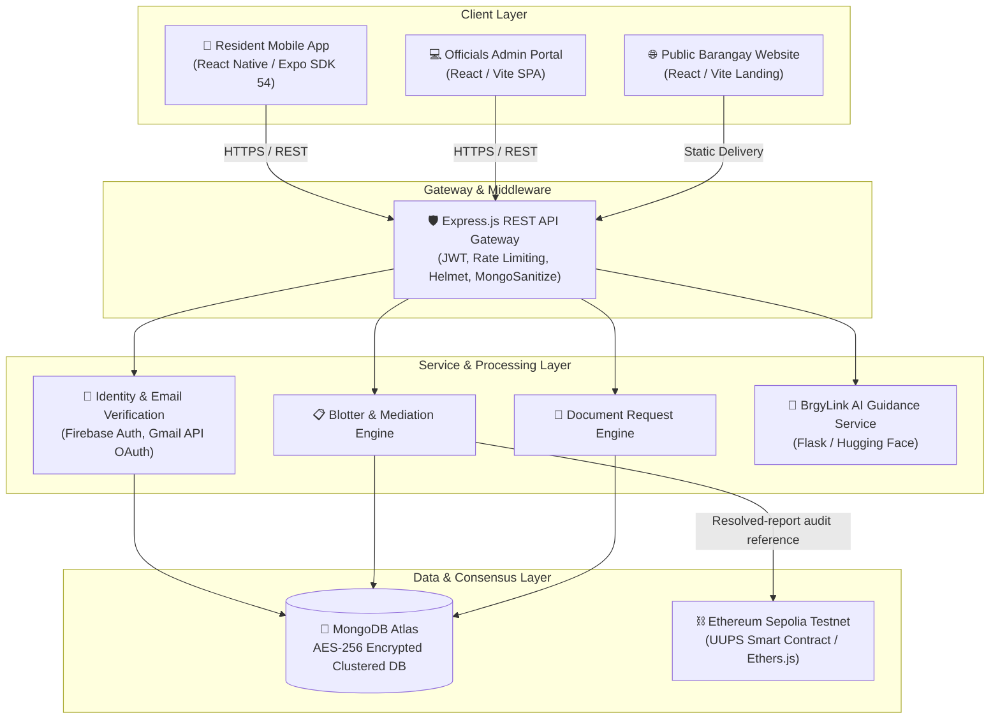

# 🏛️ Barangay Bagong Pag-asa E-Services & Community Portal (BrgyLink)

<div align="center">


**A Smart Governance & Community Management Platform for Philippine Local Government Units (LGUs)**

[Developer Manual](./DEVELOPER_MANUAL.md) • [API Docs](./API_DOCS.md) • [Database Schema](./DATABASE_SCHEMA.md) • [User Manual](./USER_MANUAL.md) • [Infographic Manual](./INFOGRAPHIC_USER_MANUAL.md) • [Test Suite](./TESTING.md) • [Smart Contracts](./SMART_CONTRACT.md) • [Capstone Guide](./CAPSTONE_GUIDE.md) • [Security](./SECURITY.md) • [Deployment](./DEPLOYMENT.md)

</div>

---

## 📌 Executive Summary

**Barangay Bagong Pag-asa E-Services (BrgyLink)** is an integrated e-Governance and digital community administration platform designed to modernize public services and citizen engagement in Philippine barangays. Inspired by national *eGovPH* initiatives, the platform transforms manual, paper-based workflows into a transparent, secure, and automated digital ecosystem.

The system features:
1. **Digital Document Issuance & Verification**: Streamlined request and tracking for Barangay Clearances, Certificates of Indigency, and Residency Certificates.
2. **Blockchain Blotter Audit Reference**: Resolved blotter reports may retain a Sepolia transaction hash as a tamper-evident reference. The current legacy contract implementation is not presented as a resident reward or as a cryptographic record hash.
3. **Multilingual BrgyLink AI**: A safe guidance assistant for supported resident services in **English, Tagalog, Pangasinan, and Ilocano**.
5. **Integrated Multi-Platform Suite**: Resident Mobile App (Expo/React Native), Official Admin Dashboard (React/Vite), and Public Barangay Web Portal (React/Vite).

---

## 🏛️ System Architecture


```mermaid
graph TD
    subgraph Client Layer
        Mobile["📱 Resident Mobile App<br/>(React Native / Expo SDK 54)"]
        Admin["💻 Officials Admin Portal<br/>(React / Vite SPA)"]
        WebPortal["🌐 Public Barangay Website<br/>(React / Vite Landing)"]
    end

    subgraph Gateway & Middleware
        Gateway["🛡️ Express.js REST API Gateway<br/>(JWT, Rate Limiting, Helmet, MongoSanitize)"]
    end

    subgraph Service & Processing Layer
        AuthSvc["🔐 Identity & Email Verification<br/>(Firebase Auth, Gmail API OAuth)"]
        BlotterSvc["📋 Blotter & Mediation Engine"]
        DocSvc["📄 Document Request Engine"]
        ChatbotSvc["🤖 BrgyLink AI Guidance Service<br/>(Flask / Hugging Face)"]
    end

    subgraph Data & Consensus Layer
        MongoDB[(🍃 MongoDB Atlas<br/>AES-256 Encrypted Clustered DB)]
        Blockchain["⛓️ Ethereum Sepolia Testnet<br/>(UUPS Smart Contract / Ethers.js)"]
    end

    Mobile -->|HTTPS / REST| Gateway
    Admin -->|HTTPS / REST| Gateway
    WebPortal -->|Static Delivery| Gateway

    Gateway --> AuthSvc
    Gateway --> BlotterSvc
    Gateway --> DocSvc
    Gateway --> ChatbotSvc

    AuthSvc --> MongoDB
    BlotterSvc --> MongoDB
    DocSvc --> MongoDB
    BlotterSvc -->|Resolved-report audit reference| Blockchain
```

---

## ✨ Key Features & Capabilities

### 1. 🏛️ Digital Barangay Services
* **📝 Blotter Resolution Audit Reference**: Residents submit incident reports with location tagging and evidence. A resolved report may save a Sepolia transaction hash as an audit reference.
* **📄 Digital Document Requests**: Streamlined requesting for Barangay Clearances, Certificates of Indigency, and Residency IDs with real-time status tracking.
* **💡 Transparent Community Suggestions**: Public or anonymous suggestion box for civic infrastructure and safety improvements.
* **📢 Community Bulletin & Alerts**: Broadcast announcements, emergency advisories, and localized push notifications.
* **👥 Barangay Officials Directory**: Public hierarchy and contact matrix of Punong Barangay, Sangguniang Barangay Kagawads, and SK Officials.

### 2. 🤖 Multilingual BrgyLink AI
* **Resident guidance**: Suggested FAQ prompts and typed questions for documents, blotters, account recovery, announcements, and supported app features.
* **4 Supported Languages**: English, Tagalog, Pangasinan, and Ilocano through the BrgyLink guidance service.

---

## 🛠️ Complete Technology Stack

| Layer | Technology | Purpose / Rationale |
| :--- | :--- | :--- |
| **Mobile Frontend** | React Native (Expo SDK 54), TypeScript | Cross-platform (Android/iOS) responsive mobile client |
| **Admin Frontend** | React 18, Vite, Vanilla CSS Design System | High-performance dashboard for barangay staff |
| **Public Portal** | React 18, Vite, Lucide Icons | Responsive public landing and information portal |
| **Backend Runtime** | Node.js (v18+), Express.js | Modular MVC REST API with centralized error handling |
| **Database** | MongoDB Atlas, Mongoose ODM | Clustered NoSQL document store with compound indexing |
| **Chatbot Service** | Python, Flask, curated knowledge base | Safe resident guidance hosted on Hugging Face Spaces |
| **Blockchain** | Solidity (v0.8+), Ethers.js | Resolved-blotter audit transaction reference on Ethereum Sepolia Testnet |
| **Authentication** | Firebase Authentication, Firebase ID tokens, Gmail API OAuth | Email/password credentials are held by Firebase; BrgyLink verifies signup email with a 6-digit Gmail API code |
| **Security Suite** | Helmet, Mongo-Sanitize, XSS-Clean, Express-Rate-Limit | Hardened API gateway adhering to OWASP Top 10 |

---

## 📂 Repository Structure

```bash
mission17/
├── mission17-mobile/          # React Native (Expo) Resident Mobile App
│   ├── src/screens/          # Mobile UI screens (Auth, Blotter, Clearances, Profile, etc.)
│   ├── src/components/       # Reusable components & eGovPH design system
│   ├── src/services/         # API integration, Firebase messaging & storage
│   └── app.json              # Expo configuration & EAS OTA update channels
│
├── mission17-admin/           # Vite + React Admin Dashboard
│   ├── src/pages/            # Blotter management, Clearances, Bulletins, Officials
│   └── src/components/       # Admin sidebar, tables, modals, verification queues
│
├── mission17-website/         # Vite + React Public Barangay Portal
│   ├── public/               # Public assets & downloadable BrgyLink.apk
│   └── src/App.jsx           # Landing page with services, bulletins & officials
│
├── mission17-backend/         # Express.js REST API Server
│   ├── routes/               # 13 Modular REST API route handlers
│   ├── controllers/          # Business logic and request orchestrators
│   ├── models/               # Mongoose Schemas (User, DocumentRequest, Blotter, AuditLog)
│   ├── contracts/            # Solidity smart contracts & UUPS upgradeable proxies
│   └── config/               # Database, barangay roster, and security configurations
│
├── mission17-ai/              # Python Flask BrgyLink AI Chatbot Runtime
│   ├── app.py                # Flask REST endpoints for /predict and anti-cheat
│   ├── evaluate_model.py     # Evaluation scripts, confusion matrix, F1-score
│   └── Dockerfile            # Container deployment for Hugging Face Spaces
│
├── API_DOCS.md               # Complete REST API specification
├── DATABASE_SCHEMA.md        # Entity-Relationship Diagram & Data Dictionary
├── USER_MANUAL.md            # Citizen & Official End-User Operating Manual
├── TESTING.md                # QA Test Matrix, Adversarial AI Tests & SUS Method
├── SMART_CONTRACT.md         # Solidity Contracts, UUPS Proxy & Gas Benchmarks
├── CAPSTONE_GUIDE.md         # Academic manuscript mapping (Chapters 1–5)
├── DEFENSE_RUBRIC_GUIDE.md   # Oral defense scripting & panel rubric proof
├── SECURITY.md               # Security posture, encryption & RBAC documentation
├── THREAT_MODEL.md           # STRIDE & DREAD threat analysis matrix
├── DEPLOYMENT.md             # Production hosting & CI/CD deployment guide
├── OPTIMIZATION_REPORT.md    # Database, gas, and latency optimization benchmarks
├── MAINTENANCE.md            # Maintenance schedules & incident response SLA
├── TROUBLESHOOTING.md        # Subsystem triage & diagnostic handbook
└── CHANGELOG.md              # Semantic versioning release history
```

---

## ⚡ Quickstart & Local Setup

### 1. Prerequisites
* **Node.js**: `v18.0.0` or higher
* **Python**: `v3.9` to `v3.11`
* **MongoDB**: MongoDB Atlas URI or local instance
* **Expo Go**: Installed on an Android/iOS test device

---

### 2. Environment Variables Configuration

Create a `.env` file inside `mission17-backend/`:
```env
PORT=5001
MONGO_URI=mongodb+srv://<username>:<password>@cluster.mongodb.net/mission17
JWT_SECRET=your_super_secret_64_character_hex_string
FIREBASE_WEB_API_KEY=your_firebase_web_api_key
EMAIL_USER=your_gmail_sender@gmail.com
GOOGLE_CLIENT_ID=your_google_oauth_client_id
GOOGLE_CLIENT_SECRET=your_google_oauth_client_secret
GOOGLE_REFRESH_TOKEN=your_google_oauth_refresh_token
AI_SERVER_URL=https://<your-hugging-face-space>.hf.space/predict
AI_SERVICE_TOKEN=<shared-ai-service-token>
SEPOLIA_RPC_URL=https://eth-sepolia.g.alchemy.com/v2/your_alchemy_key
ADMIN_PRIVATE_KEY=0x_your_sponsor_wallet_private_key
CONTRACT_ADDRESS=0x_your_deployed_contract_address
AI_SERVER_URL=http://localhost:7860
```

---

### 3. Step-by-Step Local Launch

#### A. Backend API Server
```bash
cd mission17-backend
npm install
npm run dev
# Running on http://localhost:5001
```

#### B. BrgyLink AI Service
```bash
cd mission17-ai
python -m venv venv
# Windows:
.\venv\Scripts\activate
# Linux/macOS:
source venv/bin/activate
pip install -r requirements.txt
python app.py
# Running on http://localhost:7860
```

#### C. Officials Admin Portal
```bash
cd mission17-admin
npm install
npm run dev
# Running on http://localhost:5173
```

#### D. Public Barangay Portal
```bash
cd mission17-website
npm install
npm run dev
# Running on http://localhost:5174
```

#### E. Resident Mobile App
```bash
cd mission17-mobile
npm install
npx expo start
# Scan the displayed QR code using the Expo Go application on mobile
```

---

## 🧪 Testing & Verification

```bash
# Run backend security and route test suite
cd mission17-backend
npm test

# Run BrgyLink AI chatbot tests
cd mission17-ai
python -m unittest test_app.py

# Verify smart contract gas and functionality
cd mission17-backend
node gas-perf-test.js
```

---

## 👥 Authors & Academic Credits

* **Kurt Perez** - *Lead Systems Architect & Full-Stack Developer*
* **Mission 17 Development Team** - *Barangay Bagong Pag-asa Capstone Initiative*

---

## 📄 License & Academic Integrity

This project is licensed under the **MIT License**. Created for academic research, local government digital transformation, and educational defense.
