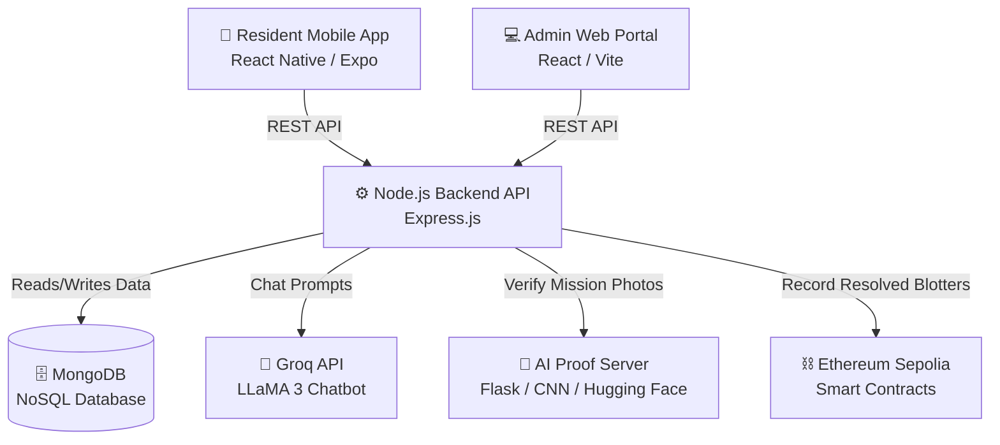

# Architecture Notes

This document contains the system design, components, and data flow for the Mission17 ecosystem.

## 🏗️ System Architecture Diagram

## 📦 Components Breakdown

### 1. `mission17-mobile` (Resident Frontend)
- **Tech:** React Native, Expo, TypeScript
- **Role:** The primary app for citizens. Features include submitting blotter reports, requesting documents, asking the AI Chatbot questions, and completing gamified SDG missions (like tree planting).

### 2. `mission17-admin` (Barangay Officials Portal)
- **Tech:** React.js, Vite, Vanilla CSS
- **Role:** Web dashboard for barangay officials to view and manage citizen requests. Officials can resolve blotter reports here (which triggers the blockchain record) and approve/deny documents.

### 3. `mission17-backend` (Main API)
- **Tech:** Node.js, Express.js, Mongoose
- **Role:** The central nervous system. It handles authentication (JWT), routes all mobile/web traffic, connects to MongoDB, and orchestrates calls to the external AI and Blockchain services.

### 4. `mission17-ai` (Proof Verification Server)
- **Tech:** Python, Flask, TensorFlow
- **Role:** Hosted independently on Hugging Face Spaces. It runs a custom Convolutional Neural Network (CNN) to verify user-uploaded images for SDG missions and includes an anti-cheat system to detect duplicate images.

### 5. Third-Party Integrations
- **Database:** MongoDB (User data, reports, points).
- **Blockchain:** Ethereum Sepolia Testnet (Ethers.js is used to immutably record resolved blotter reports using a Gasless Sponsor Wallet).
- **LLM:** Groq API running LLaMA 3 for lightning-fast chatbot responses in the mobile app.
